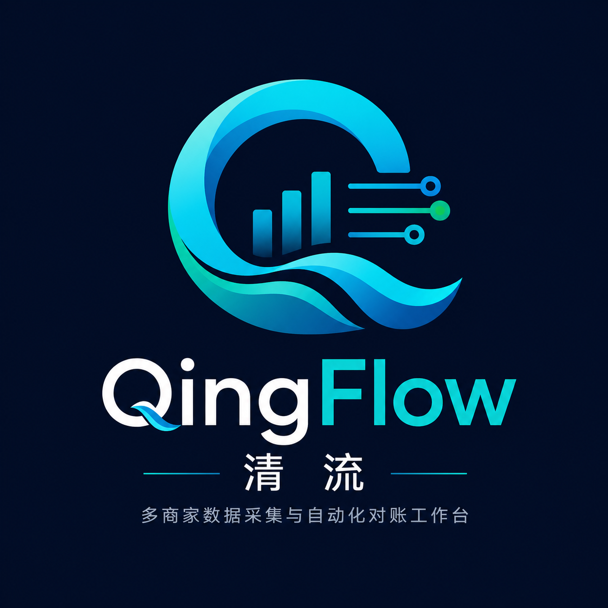
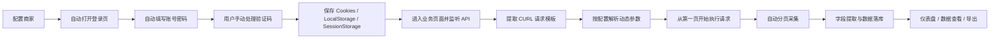

# QingFlow 清流



**QingFlow 清流** 是一个面向多商家后台的桌面自动化数据采集与对账工作台。

它的目标不是做验证码破解工具，而是把真实业务里重复、分散、容易出错的后台数据提取流程产品化：自动打开商家后台、自动填表登录、等待用户手动处理验证码、保存浏览器凭证，再通过监听到的业务 API 组装请求并分页获取数据。

## 产品定位

**多商家数据采集与自动化对账工作台**

适合下面这类场景：

- 多个商家后台需要每天登录查看经营、结算、回款、对账数据
- 登录流程存在验证码，需要用户人工完成一次验证
- 数据接口隐藏在页面请求里，需要通过浏览器监听 API 后复用
- 不同商家、不同平台字段不同，需要可配置的字段映射和动态参数
- 采集结果需要统一落库、查看、导出和后续对账

## 核心业务流程



## 核心能力

| 能力 | 说明 |
|------|------|
| 商家配置 | 管理多个商家后台的地址、登录页、账号、密码和选择器 |
| 自动化登录 | Playwright 打开页面并自动填写表单，验证码由用户手动处理 |
| 凭证保存 | 保存并加密 Cookies、LocalStorage、SessionStorage 等浏览器状态 |
| iframe 页面支持 | 点击、监听和抓包逻辑支持业务页面嵌在 iframe 内的情况 |
| API 监听 | 点击查询按钮后监听目标 API，请求可封装为 CURL 模板 |
| CURL 回放 | 抓到 CURL 后由引擎主动执行请求，不依赖页面继续加载 |
| 动态参数 | 支持从 storage、session、cookie、变量中提取参数并替换请求体 |
| 分页采集 | CURL 模板从第一页开始执行，按分页规则循环获取数据 |
| 数据落库 | 采集结果存入本地 SQLite，支持查看和导出 |
| 仪表盘 | 汇总商家数、今日任务、成功率、数据总量、采集趋势和最近活动 |

## 动态参数规则

QingFlow 会先收集浏览器当前上下文中的状态，再按配置提取需要的值。

支持的引用格式：

```text
$storage:<origin>:<storageKey>.<jsonPath>
$session:<origin>:<storageKey>.<jsonPath>
$cookie:<origin>:<cookieName>
$variableName
```

示例：

```text
$storage:https://meituan.example.com:ME_SELECTED_POI_INFO_CACHE_KEY.value.partnerId
$storage:https://meituan.example.com:ME_SELECTED_POI_INFO_CACHE_KEY.value.poiId
$cookie:https://meituan.example.com:token
```

更多自动化业务配置细节见：

- [自动化业务采集配置说明](docs/automation-capture.md)

## 技术架构

```text
┌─────────────────────────────────────────────┐
│                QingFlow 桌面应用             │
│  ┌──────────────────┐  ┌────────────────┐   │
│  │ Vue 3 渲染进程    │  │ Electron 主进程 │   │
│  │ 仪表盘/配置/数据   │◄─►│ IPC / 窗口管理 │   │
│  └──────────────────┘  └──────┬─────────┘   │
│                                │ JSON-RPC    │
│                         ┌──────▼─────────┐   │
│                         │ Python 子进程   │   │
│                         │ Playwright     │   │
│                         │ HTTP 回放采集   │   │
│                         │ SQLite 存储     │   │
│                         └────────────────┘   │
└─────────────────────────────────────────────┘
```

## 项目结构

```text
finance_tools/
├── electron/                  # Electron 主进程、IPC、Python 子进程管理
├── src/                       # Vue 3 前端渲染进程
│   ├── views/                 # 仪表盘、商家配置、任务调度、数据查看
│   ├── components/            # 公共组件
│   ├── stores/                # Pinia 状态管理
│   ├── api/                   # 前端 API 封装
│   └── styles/                # 全局样式
├── python/                    # Python 后端引擎
│   ├── main.py                # JSON-RPC 入口
│   ├── engine/                # 登录、抓包、CURL、浏览器自动化
│   ├── db/                    # SQLite 初始化、迁移、Repository
│   └── utils/                 # 加密、日志、工具函数
├── shared/                    # 共享 schema 和运行时数据库目录
├── docs/                      # 业务采集配置文档
├── package.json               # 根项目配置
└── README.md
```

## 快速开始

### 前提条件

- Node.js >= 18
- Python >= 3.10
- npm

### 安装依赖

```bash
npm install
cd src && npm install && cd ..

python3 -m venv python/.venv
source python/.venv/bin/activate
pip install -r python/requirements.txt
playwright install chromium
```

### 开发运行

```bash
npm run dev
```

如果需要开启 Python 远程调试：

```bash
PYTHON_DEBUG=1 PYTHON_DEBUG_HOST=127.0.0.1 PYTHON_DEBUG_PORT=5678 npm run dev
```

默认不连接调试器，避免 Debug Server 未启动时后端无法启动。

### 构建

```bash
npm run build:app
```

打包：

```bash
npm run build
npm run build:mac
```

## 数据库

当前使用本地 SQLite。核心表包括：

- `merchants`：商家配置
- `credentials`：加密凭证和浏览器状态
- `tasks`：采集任务配置
- `task_runs`：任务运行流水，供仪表盘统计
- `collected_data`：采集结果

## 安全说明

- 凭证和浏览器状态只保存在本机
- Cookie、密码等敏感信息会加密存储
- 渲染进程通过 preload 白名单访问 IPC
- 默认不开启 Python Debug 连接

## 品牌

- 产品名：**QingFlow**
- 中文名：**清流**
- 作者：**周清胜 / ZHOUQINGSHENG**
- 定位：**多商家数据采集与自动化对账工作台**

## License

MIT
